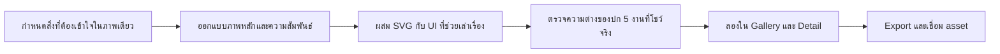
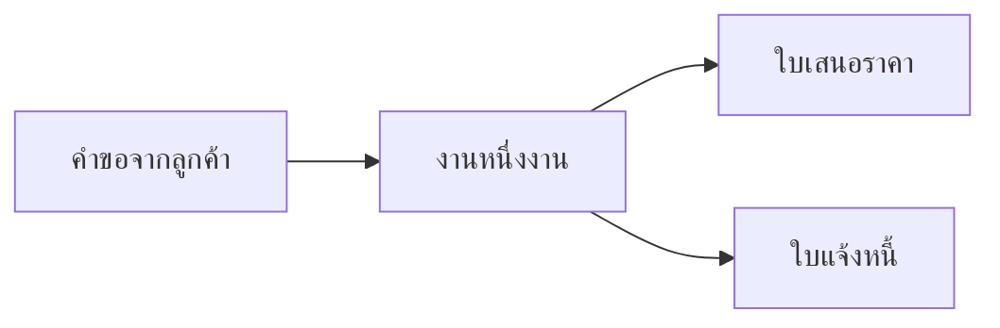

# Project cover specification

**Creator correction, 5 September 2026:** cover/thumbnail artwork uses each application's color identity — explicitly vivid blue for FreeFlow — and must be a finished, rich, attention-catching composition. Monochrome is superseded for covers; each composition must also use distinct shapes and recognizable app/tool logos rather than a repeated template. White/gray editorial text remains a project-detail constraint. The first production renders were prototype-like and were rejected as final art; retain their selected meaning/composition directions, then rebuild visual finish, branded color and meaningful product detail before acceptance.

วันที่ 5 กันยายน 2026 · Scope รอบปัจจุบัน: 5 featured projects — FreeFlow, ModeNote, Veluma, Keshi, Hermes. Zucchini/Decrypt ไม่อยู่ในงานผลิตปกรอบนี้ตามคำสั่งล่าสุด

สถานะ: ผู้ใช้ยืนยันให้ปกเป็นงานออกแบบที่สื่อความหมายของโปรดักต์ โดยใช้ HTML/CSS + SVG ร่วมกับ UI จริงตามความเหมาะสม ภาพหน้าจออย่างเดียวอาจธรรมดาหรืออธิบายงานไม่ได้ เฟส 1 เลือกครบ 3 โปรเจกต์: **FreeFlow B — Project dossier**, **ModeNote B — Source thread**, **Veluma A — Saved Canvas** [เปิด comparison board](http://127.0.0.1:5173/output/project-covers/). Veluma final ต้องใช้ [creator vision](../projects/veluma-product-vision.md): coding space ที่มี mood/ความเป็นมนุษย์ พร้อมไอคอนเครื่องมือร่วมกับชื่อ; เฟส 2 ผลิต version 3 แล้ว ดู [production studio](http://127.0.0.1:5173/design/project-covers/) และ [run record](implementation/runs/2026-09-05-phase-2-production.md)

แผนภาพรวม: [Design review plan](2026-09-05-design-review-plan.md)

การ execute ใช้ [Phase map](implementation/README.md): เฟส 1 สำหรับ concept previews และเฟส 2 สำหรับผลิต/เชื่อมปกทีละงาน ทุกหน่วยจบแล้วหยุดตามคำสั่งผู้ใช้ Workflow ด้านล่างอธิบายเส้นทางงาน ไม่ใช่คำสั่งให้ทำทุกขั้นรวดเดียว

## Workflow



## ทิศทางที่แก้จากการคุยล่าสุด

ปกมีหน้าที่ทำให้เข้าใจและสนใจโปรดักต์ ภาพหน้าจอเป็นวัตถุดิบหนึ่งชนิด ไม่ใช่ข้อกำหนดว่าต้องเป็นภาพหลักทุกงาน ยกเลิกสัดส่วน screenshot อย่างน้อย 75% และยกเลิกการใช้การ crop เป็นคำตอบอัตโนมัติ

ก่อนเลือกภาพต้องเขียน brief ต่อโปรเจกต์ให้ได้ 3 บรรทัด:

1. คนดูต้องเข้าใจว่าโปรดักต์นี้ช่วยทำอะไร ภายใน 3–5 วินาที
2. วัตถุ/เหตุการณ์ใดสื่อประโยชน์นั้นได้ เช่น งาน เอกสาร บทสนทนา หรือฉาก terminal
3. องค์ประกอบใดทำให้ภาพจำได้ เช่น การเชื่อมงานเดียวผ่านเอกสารหลายชนิด หรือการเปลี่ยนเสียงเป็นข้อความที่ย้อนอ้างอิงได้

องค์ประกอบสามชั้น:

- **ภาพหลัก:** ออกแบบ SVG/typography/spatial composition ให้เห็น behavior หรือผลลัพธ์หนึ่งอย่าง รูปทรง ตำแหน่ง ขนาด และพื้นที่ว่างสร้างจุดสนใจ
- **ส่วนพิสูจน์:** เลือก crop ของ UI จริงมาเป็น detail ที่ยืนยันความสัมพันธ์นั้น ใช้เมื่อช่วย; บางปกอาจไม่จำเป็นต้องมี screenshot
- **Identity:** ชื่อ โลโก้ หรือองค์ประกอบของแบรนด์ในตำแหน่งที่ตั้งใจ ความเด่นมาจากลำดับภาพและการจัดวาง ไม่ต้องเพิ่มของตกแต่งจำนวนมาก

วาด document cards, conversation fragments, timeline หรือ simplified UI ด้วย SVG ได้เมื่อใช้เป็นภาพอธิบายที่อิงพฤติกรรมจริง ไม่ปลอมให้เป็น app capture หรือภาพผลการใช้งานจริงที่ไม่มีหลักฐาน Screenshot เต็มและ demo จริงยังอยู่ใน project details

## ตัวอย่างกำหนดภาพ: FreeFlow

**สิ่งที่ต้องเข้าใจ:** งานฟรีแลนซ์หนึ่งงานเชื่อมข้อมูลลูกค้า งานที่ทำ และเอกสารการเงินไว้ด้วยกัน

**ภาพปกที่เสนอ:** ให้วัตถุ Project อยู่กลางภาพ มี request เข้าจากซ้าย และ quote/invoice เป็นเอกสารขนาดต่างกันที่เกี่ยวกับ project เดียวกัน เส้นเชื่อมขาวทำให้เห็นว่าข้อมูลไม่ได้แยกเป็นคนละกอง ภาพ UI จริงเป็น crop เล็กบริเวณ project/client record หากมีแหล่งที่เหมาะ



Mermaid แสดงความหมายเท่านั้น ภาพสุดท้ายต้องเป็น composition ที่มีจุดเด่น: project object ใหญ่, เอกสารรองซ้อนอย่างมีระยะ, โครงข้อมูลเอกสารที่จำรูปทรงได้ และพื้นที่ว่างที่ชี้สายตา ไม่ export flowchart กล่องเท่ากันมาใช้เป็นปก

สองแนวเพื่อเปรียบเทียบก่อนผลิตชุด:

- **Job thread:** เส้นต่อเนื่องผ่าน request → quote → project → invoice; เอกสารหลายชนิดมี project reference ร่วมกัน มุ่งให้เข้าใจเส้นทางงาน
- **Project dossier:** หนึ่งแฟ้มงานเป็นศูนย์กลาง เชื่อมลูกค้า/เอกสาร/กำหนดการ มุ่งให้รู้สึกว่างานทั้งหมดอยู่ในบริบทเดียว

คำประกอบที่เป็นไปได้: `Freelance work, connected.` หรือ `Clients · Projects · Invoices` ใช้แบบสั้นเพียงหนึ่งชุดตาม composition ไม่วาง slogan ซ้ำหลายชั้น ไม่สื่อว่าชำระเงินอัตโนมัติหรือมี paid state ที่ยังไม่ได้พิสูจน์

## กติกาของชุด

| เรื่อง | สเปก |
|---|---|
| หลักฐาน | ผสม conceptual illustration และ app capture ได้โดยแยก provenance; SVG ย่อความจากฟีเจอร์จริงได้ แต่ไม่ปลอมผลลัพธ์หรือภาพ capture |
| วิธีผลิต | HTML/CSS สำหรับ composition; SVG สร้างวัตถุหลัก เส้นทางข้อมูล simplified UI และ brand cues; render แบบกำหนด viewport และรอ font/image โหลดครบ |
| สี | ใช้สี identity ของแอปทั้ง artwork, type, shapes และ material; FreeFlow น้ำเงินสด. ข้อจำกัดขาว–เทาเป็นของ editorial text ใน details เท่านั้น |
| องค์ประกอบ | Subject หลักหนึ่งอย่างจากความหมายของโปรดักต์; SVG และ UI มีสัดส่วนตามสิ่งที่ช่วยเข้าใจ ไม่มี minimum screenshot ratio |
| สัดส่วนเริ่มต้น | Master 1600×1000 (8:5), ทดลอง safe area 5% รอบขอบ; ยืนยันหลังเห็นใน orbit ไม่บิดภาพแอปให้เต็มกรอบ |
| รูปต้นทาง | เลือกภาพที่คมพอในขนาดใช้งาน; upscale ไม่ใช่เหตุผลให้ถือว่ารายละเอียดอ่านได้; หาก crop แล้วไม่พอให้เลือกเฟรม/ถ่ายใหม่ |
| Typography | ชื่อหลักยังมี DOM กำกับ; ในปกใช้คำบอกหน้าที่ 3–6 คำหรือ brand title เป็นส่วน composition ได้ ถ้าช่วยให้เข้าใจ ไม่ใส่คำโฆษณาซ้ำหลายระดับ |
| ความหมาย | ภาพหลาย frames ต้องแสดงว่าเป็น montage ไม่จัดต่อให้ดูเป็นหน้าจอหรือสถานะเดียวที่ไม่มีอยู่จริง |
| Export | PNG master + WebP ส่งเว็บ; เริ่มทดสอบ WebP quality 88 แล้วดูข้อความจริง; ขนาดไฟล์เป้าหมายไม่เกิน 500KB เมื่อความคมยอมรับได้ ไม่ยึด quota จนภาพเสีย |
| สิ่งที่ต้องเลี่ยง | Glow สี, อุปกรณ์ลอย, ฉากเครื่องจักร, props หลายชุด, ข้อความ marketing ซ้ำหน้าเว็บ, fake metrics |

การเพิ่มกรอบเป็นทางเลือกตามภาพ ไม่ใส่ browser chrome/device mockup ใหญ่เป็นข้อบังคับทุกงาน

**Veluma — vision จากผู้สร้าง:** A เป็นฐาน composition ที่เลือก ไม่ได้ล็อก text-only labels หรือความเรียบหม่นของพรีวิว ให้เพิ่ม recognizable icons ของ agents/tools คู่กับชื่อ และให้ Canvas จริงสื่อชีวิต สี บุคลิก และความรู้สึกว่าเป็นพื้นที่ของผู้ใช้. ข้อความ/annotations ใน details ยังคงขาว–เทา; ปกใช้สี scene/material และ identity เครื่องมือเพื่อเล่าเรื่อง ไม่ใช้ความ neutral หรือ Auto Tile เป็นคำตอบแทน vision นี้. อ่าน [บันทึกเต็ม](../projects/veluma-product-vision.md) ก่อนทำ 2.3 และ 3.4

## Asset และแผนรายงาน

Paths ในตารางอ้างจาก `public/assets/` เป็น candidate ที่ตรวจพบใน workspace; ยังไม่ใช่การตัดสินว่าทุกภาพพร้อมเป็น final cover

| งาน | ภาพหลักที่ต้องการ | Source candidate | งานก่อนจัดปก |
|---|---|---|---|
| Keshi | Timer/FOCUS | `keshi-pomodoro/main_page.webp`, `main_page.mp4` | เก็บฐานเดิม เลือก crop ที่ timer ใหญ่; radio/photo เป็นรอง |
| ModeNote | Session workspace ที่มีข้อมูลอ่านได้ | `modenote/evidence-workspace.jpg`, `evidence-workspace.mp4`, `session-library.jpg`; `logo-buddy.svg` รอง | Still ปัจจุบันเป็น transcript tab; หา recap frame จากคลิปก่อนทำ variant เน้นผลลัพธ์; อย่าอ้างว่า still นี้แสดง recap อยู่แล้ว |
| FreeFlow | Workspace ที่เห็นงาน/เอกสาร | `freeflow/product-overview.mp4`, `business-dashboard.mp4`, poster คู่กัน | Still overview ที่ตรวจมีช่อง empty และพื้นที่ว่างมาก; เลือกช่วงที่มีงานชัด โดยไม่เติมยอดเงิน/สถานะสมมติในภาพ |
| Veluma | Canvas จริงและความสัมพันธ์ระหว่าง panes | `veluma/project-return.gif`, `reset-canvas.gif`, `canvas-thumbnail.png` | Thumbnail ที่ตรวจเป็น demo commands แน่น; เลือกเฟรมที่สงบและชื่อ pane ชัด ตรวจ path/ข้อความก่อนใช้ |
| Zucchini | Film context + คะแนน/รีวิว | `previews/zucchini-review-result-repo.png`, `zucchini-homepage-live.png` | ให้ review result เป็นหลัก; คง provenance ว่าเป็น repository demo เมื่อใช้ภาพนั้น |
| Decrypt | Password + countdown + กฎสำคัญ | `previews/decrypt-gameplay.jpg`, `decrypt-select-mode.jpg` | ตรวจความคมหลัง crop; หากไม่พอ capture ใหม่จากตัวเกมเมื่อถึงรอบผลิต; ยังไม่มี motion proof ใน gallery ปัจจุบัน |
| Hermes | Discord request กับ response จริงที่พร้อมเผยแพร่ | ยังไม่มี app capture ใน `public/assets/hermes-command-center/` มีเฉพาะ conceptual covers | เตรียม capture ตาม `docs/projects/hermes-demo-capture-plan.md`; ระหว่างยังขาด ใช้ SVG diagram ที่ระบุ illustrative ใน preview ห้ามเรียกว่าภาพแอปจริง |

ตาราง source ด้านบนเป็นคลังวัตถุดิบ ไม่ใช่ข้อกำหนดให้ screenshot เป็น hero ของแต่ละปก แนว represent ที่ใช้เลือก composition:

| งาน | สิ่งที่ภาพต้องสื่อ | บทบาท SVG | บทบาท UI จริง |
|---|---|---|---|
| Keshi | จังหวะ focus → relax | เส้นเวลา/วง interval อย่างสงบถ้าจำเป็น | Timer มี identity ดีอยู่แล้ว จึงนำภาพได้ |
| ModeNote | บทสนทนากลายเป็นข้อมูลที่ย้อนตรวจได้ | เส้นเชื่อม transcript fragment กับ recap/source marker | ข้อความ/recap crop เป็นหลักฐาน เลือกจาก session ที่สัมพันธ์จริง |
| FreeFlow | ลูกค้า งาน และเอกสารอยู่ในบริบทเดียว | Project/document objects และเส้นเชื่อมที่เป็นภาพหลัก | ใช้ record crop รอง แทนยก dashboard ทั้งหน้า |
| Veluma | กลับมาหาพื้นที่ coding ที่มี mood และบุคลิกของผู้ใช้ | **A ที่เลือก:** saved pane map + recognizable agent/tool icons คู่กับชื่อ เชื่อม Canvas จริง; B เป็นเพียง alternative | ภาพจริงแสดง backdrop/material/arrangement อย่างมีชีวิต; A ปัจจุบันใช้ start-stack.gif frame 0 ก่อนรัน; เลือก frame final ตาม vision และคงความจริงเรื่อง explicit Start |
| Zucchini | ความเห็นหลายด้านเกี่ยวกับหนังเรื่องเดียว | Five-axis marks ผูกกับ film/review object | Review fragment ให้รู้ว่าคะแนนมีความเห็นประกอบ |
| Decrypt | Password ถูกเวลาและกฎกดดัน | ตัวอักษร/clock/rule cue มี hierarchy ชัด | Gameplay fragment ที่รองรับกลไก ไม่ใส่ทั้งหน้ากฎยาว |
| Hermes | Request ถูกส่งไปแหล่งข้อมูลแล้วกลับมาเป็นคำตอบ | Request/route/return composition เป็นภาพหลักได้ | Discord capture เป็นหลักฐานเมื่อพร้อมใช้ |

โปรเจกต์ที่แหล่งภาพพร้อมทำต่อได้โดยไม่ต้องรอ Hermes; ภาพ Hermes มี dependency แยก ไม่ใช้ภาพ Discord จำลองแทนผลจริง

## ModeNote — ตัวเลือกตามความหมายของภาพ

| Variant | องค์ประกอบ | สิ่งที่กำลังเปรียบเทียบ |
|---|---|---|
| A · Conversation to evidence | Transcript fragment เปลี่ยนเป็น recap/source-linked note ด้วย SVG relationship, UI crop สนับสนุน | เข้าใจประโยชน์จากการคุยไปเป็นข้อมูลที่ใช้ต่อได้ |
| B · Source thread | ข้อความสำคัญหนึ่งช่วงเป็นศูนย์กลาง ผูกกับ recap และ timestamp ที่ย้อนหาได้ | เข้าใจความน่าเชื่อถือจากการเชื่อมกลับต้นทาง |
| C · Session memory | Session object เชื่อมบทสนทนา ผลสรุป และการกลับมาค้น พร้อม Buddy เล็กเมื่อช่วย identity | ภาพรวมการเก็บบริบทให้กลับมาใช้ได้ |

ทุก variant ที่ใช้ recap/quote เป็นข้อความจาก capture ต้องมี frame รองรับ หากยังไม่มี ใช้ illustrative labels ชัด ๆ สำหรับ concept sketch แล้วระบุ evidence ที่ต้องหา ไม่แต่งข้อความขึ้นมาอ้างว่าเป็น output ของ session จริง

Preview board วาง A/B/C ที่ขนาดเท่ากัน แสดงทั้ง 1600px, 240px และ 120px; ใช้ชื่อและ caption ภายนอกภาพแบบเดียวกัน

## Deliverables ในรอบผลิต

```text
output/project-covers/
  index.html                 # ดูปกและ variants ด้วยกัน
  covers.mjs                 # source asset, crop, composition settings
  render.cjs                 # renderer ที่รันซ้ำได้
  previews/                  # pilot และ contact sheets
  exports/                   # PNG master / WebP candidates
```

รายงานสั้นต่อปก: source path + selected frame time (ถ้ามี) + provenance + วิธี crop + เหตุผลเลือกองค์ประกอบ ไม่แก้ไฟล์ต้นฉบับทับ

เมื่อทิศทางถูกเลือกแล้วค่อยนำ final assets เข้า `public/assets/project-covers/` ด้วยชื่อระบุ version เช่น `modenote-cover-v1.webp`

## Integration contract

- แยก `coverImage` สำหรับ gallery ออกจาก `heroMedia` และ `gallery` หลักฐานใน detail; ไม่เปลี่ยน `project.image` ทุกที่แบบเหมารวม
- `GalleryScene.jsx` มีรายการภาพแยกจาก `src/data/projects.js` และ `App.jsx` มี `GALLERY_MEDIA_REVISION`; ตอนเชื่อมงานใหม่ต้องตรวจให้ภาพและ WebGL texture เป็น version เดียวกัน ควร derive จาก metadata แหล่งเดียว
- Hero ของ case ที่ควรโชว์ UI จริงใช้ media แยกได้ ไม่บังคับนำ cover composition กลับมาแปะซ้ำ
- ตรวจ `PosterSelectTransition` ให้ต้นทางและปลายทางของภาพ transition สอดคล้องกับการแยก assets
- ตรวจ fallback/reduced motion ไม่ให้ใช้ปก ModeNote เป็นฉากหลังทุก route ตาม finding ในแผนใหญ่
- คงการตั้ง private/maintenance และงานแก้เดิมใน checkout; scope ภาพปกไม่เปลี่ยนสิทธิ์ลิงก์หรือ factual copy

## Acceptance

- เห็นที่ 120px แล้วแยกได้ว่าเป็นงานเกี่ยวกับอะไร; ไม่คาดหวังให้อ่านทุกคำใน screenshot
- แสดงภาพ 3–5 วินาทีแล้วผู้ชมอธิบายหน้าที่ของโปรดักต์ได้คร่าว ๆ โดยไม่ต้องรู้ชื่อมาก่อน
- จุดสนใจแรกต้องช่วยสื่อความหมายของงาน SVG แต่ละชิ้นต้องเพิ่มความเข้าใจ/identity/ลำดับภาพ ไม่เพิ่มเพราะพื้นที่ว่าง
- ที่ 240px เห็น subject และ brand cue โดยไม่ต้องอ่านสโลแกน
- ที่ hero scale ตัวหนังสือ/ขอบแอปคม ไม่ผิดสัดส่วนหรือถูกตัดตรงจุดสำคัญ
- ปกทั้ง 5 ที่อยู่ใน gallery ใช้พื้นที่และน้ำหนักที่เข้ากัน แต่ยังมีเอกลักษณ์จากโปรดักต์
- ภาพ screenshot ไม่ถูกแต่งให้แสดง feature/ผลที่ไม่มีจริง; simulation/demo มี provenance ตรงชนิด
- ทดสอบ orbit, เข้า detail และ transition ที่ desktop กับ mobile รวม reduced motion
- ตรวจภาพ export จริง หลัง font และ asset โหลด ไม่ตรวจจากโค้ดอย่างเดียว
- ก่อนจบรอบส่ง preview เทียบให้เห็นงานจริง; การเลือก direction ยังไม่ถือว่า final mockup ได้รับเลือกแล้ว

## จุดเริ่มที่พร้อม

เริ่มด้วย concept sketches ของ FreeFlow สองแนวเพื่อพิสูจน์การ represent โปรดักต์ที่ raw screenshot ยังเล่าไม่ชัด แล้วใช้หลักที่ลงตัวกับ ModeNote และงานอื่น Preview แยกจาก UI ปัจจุบัน; ไม่จำเป็นต้องผลิตสาม variants ทุกงานถ้าทิศทางชัดแล้ว

