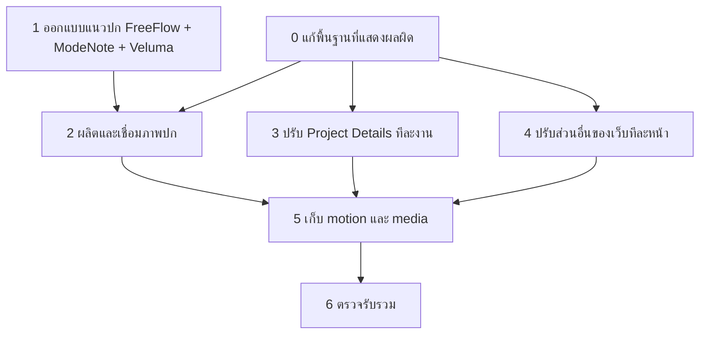

# PortfolioX — แผน execute แยกเฟส

**ขอบเขตล่าสุด 5 กันยายน 2026:** ทำเฟส 2 ต่อเนื่องเฉพาะ **5 โปรเจกต์ที่อยู่ใน gallery: FreeFlow, ModeNote, Veluma, Keshi และ Hermes**. ผู้ใช้ตัด Zucchini/Decrypt ออกจากรอบนี้แล้ว; 2.5–2.6 ไม่ได้เป็นงานค้างของเฟส 2 ชุดนี้. ไม่ข้ามไปเฟส 3

**ModeNote เลือกแล้ว; เริ่มพรีวิว Veluma ต่อ:** ผู้ใช้รับแบบ polished ที่คง layout คลังเซสชัน + AI voice notes + Buddy และสั่งทำโปรเจกต์ถัดไป. งานถัดมาคือ Veluma A — Saved Canvas ตาม creator vision. FreeFlow/ModeNote ถูกเลือกด้านดีไซน์แต่ยังไม่เชื่อมภาพใหม่เข้า production.

**ModeNote รอบเก็บรายละเอียด:** ผู้ใช้เห็นว่ารอบคืนองค์ประกอบและแก้ข้อความดีขึ้น จึงขอเพิ่มความน่าสนใจเล็กน้อย. เพิ่มลายคลื่นเสียงโทน copper, Buddy แบบสติกเกอร์ และแสงเงา/ขอบชั้น UI โดยคงข้อความและตำแหน่ง/ครอปภาพเดิม. หน้าเดิมมีปุ่มเทียบก่อนเก็บรายละเอียด; ยังเป็นพรีวิวและยังไม่แทน production.

**ModeNote สถานะล่าสุด:** ผู้ใช้ไม่รับการเปลี่ยนเป็นแผนภาพสามขั้น และย้ำว่าขอแก้เพียงเล็กน้อยจากรอบคลังเซสชันที่ดีขึ้นแล้ว. คืนองค์ประกอบรอบนั้นและแก้เฉพาะ copy/ขนาด/คอนทราสต์เป็น **AI voice notes**, **Record**, **Transcript**. ภาพและตำแหน่ง UI คงเดิม. ตรวจที่ 240px/120px; ห้ามใช้ข้อความจิ๋วใน screenshot เป็นหลักในการสื่อความหมาย. [เปิดขนาด thumbnail](http://127.0.0.1:5173/design/project-covers/modenote-ui-preview/#thumbnail-review). ยังไม่แทน production และไม่ถือว่าผู้ใช้รับแล้ว.

สถานะ: เฟส 0–1 และ 2.0 เสร็จ; **เฟส 2 ยังไม่เสร็จด้านดีไซน์**. ผู้ใช้ไม่รับปก version 3 ของ FreeFlow, ModeNote, Veluma และ Keshi; คงทิศทาง Hermes. กำลังใช้ [YouTube launch thumbnail references](http://127.0.0.1:5173/design/references/youtube-launch-thumbnails/) วาง art direction ใหม่ ก่อนแก้ภาพต่อ ดู [บันทึกรอบผลิต](runs/2026-09-05-phase-2-production.md)

ข้อกำหนด: ปกใช้สี identity, โลโก้จริง และโครงภาพเฉพาะแต่ละแอป; FreeFlow ต้องน้ำเงินสด. ขาว–เทาใช้กับข้อความใน project details. ไม่ใช้ layout เดียวเปลี่ยนชื่อ/สีทุกปก

**ทิศทาง FreeFlow ได้รับการยอมรับแล้ว** — ผู้ใช้ชอบ [พรีวิวแฟ้มงานสีน้ำเงิน + UI จริง](http://127.0.0.1:5173/design/project-covers/freeflow-ui-preview/) ว่าตรงกับ identity และให้ลองใช้วิธีคิดนี้กับโปรดักต์อื่นต่อ. ใช้หลัก UI จริง + โลโก้จริง + ฉาก/วัสดุเฉพาะโปรดักต์; ไม่คัดลอก layout แฟ้มงานไปทุกแอป. ยังไม่แทนปก production; ต้องเก็บความคม UI และ integration ต่อ. [บันทึกและแหล่งภาพ](../../../design/project-covers/freeflow-ui-preview/README.md)

**ModeNote ปรับหลังผู้ใช้ไม่รับฉากม้วนเทป** — [เปิดภาพใหม่](http://127.0.0.1:5173/design/project-covers/modenote-ui-preview/). ผู้ใช้มองว่ารอบนั้นไม่สื่อซอฟต์แวร์และดูคล้าย ChatGPT ทั่วไป. รอบใหม่ใช้คลังเซสชัน + หน้าตั้งค่าการบันทึก + แถวบทถอดเสียงจริงเป็นหลัก คง copper/Buddy และนำวัตถุม้วนเทป/กระดาษออก. มีปุ่มเทียบรอบก่อน; ยังรอ review และไม่แทน production. [บันทึกและแหล่งภาพ](../../../design/project-covers/modenote-ui-preview/README.md)

**ModeNote ล่าสุด: บอกหน้าที่โปรดักต์ให้ชัด** — ผู้ใช้เห็นว่ารอบซอฟต์แวร์ดีขึ้นแต่ยังไม่รู้ว่าแอปทำอะไร. พรีวิวจึงนำด้วย **Voice to notes** และ **Record → Transcribe → Summarize** พร้อม UI จริงของแต่ละขั้น; ผลสรุปมาจากเฟรมเดโม 0.200s ใน evidence-workspace.mp4. คลังเซสชันถูกนำออกจากภาพหลัก. ยังเป็นพรีวิวรอ review ไม่ใช่ปก production.

รอบที่ผู้ใช้สั่ง `implement phase 0 - 1`: ทำครบ 0.1–0.4 และ 1.1–1.2 เป็นชุดเดียว [บันทึกส่งมอบ](runs/2026-09-05-phase-0-1.md) · [เปิดพรีวิวปก](http://127.0.0.1:5173/output/project-covers/)

ผู้ใช้ขยายขอบเขตก่อนเฟส 2 ให้เพิ่ม **1.3 Veluma** และเลือก **A — Saved Canvas** แล้ว [บันทึก 1.3](runs/2026-09-05-1.3.md) · [เปิด Veluma](http://127.0.0.1:5173/output/project-covers/?project=Veluma). งาน final ต้องเพิ่มไอคอน agent/tool และดึง mood/ความเป็นมนุษย์ของ Canvas ตาม [creator vision](../../projects/veluma-product-vision.md)

เอกสารนี้เป็นแหล่งอ้างอิงหลักสำหรับลำดับการทำงานและจุดหยุด แทนตารางรอบใน review เดิม ข้อกำหนดเรื่องภาพใช้ [Cover spec](../2026-09-05-project-cover-spec.md); รายละเอียดราย section ใช้ [Design review](../2026-09-05-design-review-plan.md)

## กติกาที่ผู้ใช้กำหนด

- Execute ทีละหน่วย ไม่ทำทุกเฟสรวดเดียว
- คำสั่ง `เริ่มเฟส N` ที่มีหน่วยย่อย ให้เริ่มหน่วยแรกที่พร้อมและยังไม่เสร็จ แล้วจบการทำงานที่หน่วยนั้น แสดงหน่วยที่จะทำใน progress update ก่อนเริ่ม
- คำสั่งระบุหน่วย เช่น `ทำ 3.2 FreeFlow` ให้ทำเฉพาะหน่วยนั้น ถ้าขาด prerequisite ให้ชี้จากแผนว่าขาดอะไร ไม่แอบรวม prerequisite ที่เปลี่ยนหน้าอื่นเข้ามา
- ถ้าผู้ใช้ระบุชุดหน่วยชัดเจน ทำชุดนั้นได้โดยไม่ถามยืนยันซ้ำ
- เมื่อจบ ส่งผลที่ดูได้และผลตรวจ แล้วรอคำสั่งครั้งต่อไป ไม่มีการข้ามไปเฟสต่อเอง
- ไม่ commit/push/deploy หรือเปิดสิทธิ์ live/repo จากคำสั่งปรับดีไซน์ เว้นแต่ผู้ใช้สั่งเพิ่ม
- ทุกรอบรักษาการแก้ที่มีอยู่ก่อนหน้า; snapshot/diff แยกงานรอบนั้น ห้าม reset/revert ทั้ง checkout เพื่อย้อนงานเฉพาะหน่วย

## ภาพรวม

เส้นคือ dependency ไม่ใช่คำสั่ง execute อัตโนมัติ เฟส 1 ทำ preview แยกจากเว็บจึงเริ่มก่อนได้; เฟส 3 ใช้ reference Keshi ที่ตกลงแล้วจึงไม่ต้องรอเฟสปก หากยังใช้ hero เดิม; เฟส 4 เลือกทำก่อนเคสที่ยังขาดหลักฐานได้ รายละเอียด dependency เป็นรายหน่วยใน spec

| เฟส | ขอบเขต | หน่วยที่สั่งได้ | ผลที่ได้ | Spec |
|---|---|---|---|---|
| 0 | ความผิดพลาดที่ยืนยันแล้ว | 0.1–0.4 แยกแต่ละอาการ | พื้นฐานอ่านได้/interaction ตรง state | [Foundation](phase-0-foundation.md) |
| 1 | Art direction ปก | 1.1 FreeFlow, 1.2 ModeNote, 1.3 Veluma | Concept preview ที่ใช้ SVG + UI ตามความหมาย | [Cover concepts](phase-1-cover-concepts.md) |
| 2 | ปก final และ asset integration | 2.0 + 2.1–2.4 และ 2.7; ไม่รวม 2.5–2.6 รอบนี้ | ปกใหม่ใน gallery/detail ที่เกี่ยวข้อง | [Cover production](phase-2-cover-production.md) |
| 3 | หน้า Project Details | 3.0 shared primitives, 3.1–3.7 ทีละงาน | Story/diagram/layout ใหม่รายเคส | [Project details](phase-3-project-details.md) |
| 4 | หน้าอื่นของ portfolio | 4.1 Gallery, 4.2 Experience, 4.3 Stack, 4.4 Contact | การเข้าถึงงาน ประสบการณ์และเอกสารชัด | [Portfolio rooms](phase-4-portfolio-rooms.md) |
| 5 | Motion และ media | 5.1 ทางเข้า/transition, 5.2 media | จังหวะการใช้เว็บและไฟล์สื่อเหมาะสม | [Motion and media](phase-5-motion-media.md) |
| 6 | ตรวจรวมของที่เลือก implement แล้ว | 6.1 integrated QA | รายงานรับงานและข้อจำกัด | [Final QA](phase-6-final-qa.md) |

## Readiness ที่ต้องแยกให้ชัด

**พร้อม:** scope, art direction constraints, storyboards รายงาน, code targets, dependencies, acceptance และจุดหยุดของทุกเฟส

**ต้องเกิดในเฟสที่เกี่ยวข้อง:** การเลือก composition ปกจาก preview, ภาพจริงเพิ่มเติมเมื่อเฟรมเดิมไม่พอ, การยืนยัน contribution เฉพาะของงานทีมที่ source ยังไม่ตอบ สิ่งเหล่านี้ไม่ใช่เหตุผลให้เดาขึ้นมาหรือหยุดงานอื่น

หลักร่วมที่ล็อกแล้ว: ข้อความ/เส้น case study ขาว–เทา; สีในแอปจริงคงได้; ปกเริ่มจากสิ่งที่ต้องสื่อแล้วผสม SVG กับ UI ตามความเหมาะสม; ไม่มีข้อบังคับสัดส่วน screenshot; รักษา identity ของแต่ละโปรดักต์และฉาก portfolio

## เกณฑ์จบทุกหน่วย

1. Scope ที่เลือกสำเร็จ พร้อม before/after หรือ concept variants ที่เปิดดูได้
2. ตรวจเฉพาะ behavior และ route ที่กระทบ รวม desktop/mobile/reduced motion เมื่อเกี่ยวข้อง
3. การเปลี่ยนโค้ดตรวจ build และ targeted lint ตามความเหมาะสม บันทึกปัญหาเดิมแยกจาก regression ของรอบนี้
4. ระบุไฟล์เปลี่ยน ผลตรวจ และสิ่งที่ยังขาดอย่างตรงไปตรงมา; ไม่ใช้ภาพที่ไม่ได้ดูเองเป็นคำอ้างว่าผ่าน visual QA
5. อัปเดตสถานะหน่วยและบันทึกส่งต่องาน แล้วหยุดตามขอบเขตที่ผู้ใช้สั่ง

Concept ที่ทำครบอาจอยู่ `awaiting selection` จนผู้ใช้เลือก; การทำหน่วยเสร็จไม่เท่ากับการอนุมัติภาพใหม่ทุกโปรเจกต์โดยอัตโนมัติ

## บันทึกส่งต่องาน

เมื่อ execute แต่ละหน่วย สร้าง `docs/design/implementation/runs/<date>-<unit>.md` สั้น ๆ ประกอบด้วย unit, scope, baseline, changed files, preview paths, checks, unresolved items และ next eligible unit

สถานะปัจจุบันใช้ [ผลผลิตเฟส 2](runs/2026-09-05-phase-2-production.md) และ [Cover studio](http://127.0.0.1:5173/design/project-covers/). แผนเก่าที่รอคำสั่งรายหน่วยหรือรวม 7 ปกถูกแทนที่ด้วยขอบเขตล่าสุดด้านบน. การปรับ body/diagram ของ details ยังอยู่เฟส 3 และยังไม่ execute
