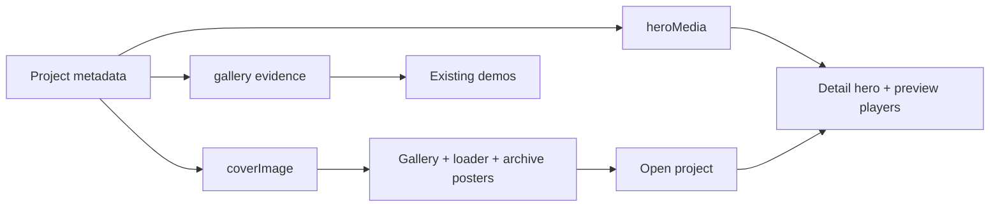

# 2.0 — Shared cover, hero and evidence metadata

Status: **complete** · 5 September 2026. Goal Phase 2 remains active for individually authorized units 2.1–2.3. This run stops at 2.0.

## Delivered

Every project now has an explicit `coverImage` and independent `heroMedia`. Existing `gallery` evidence, labels, descriptions and access metadata remain unchanged. No asset URL, artwork, page copy or CSS changed.

- `src/data/projects.js` owns all seven projects' media roles and the five featured projects' order. `galleryMediaRevision` derives from their IDs, titles and cover URLs.
- `GalleryScene.jsx` reads canonical covers. `App.jsx` uses the derived revision as its scene key so a versioned cover update rebuilds WebGL textures.
- `Loader.jsx` keeps its existing four-project sequence and preload membership, deriving URLs from the same data. Hermes is still featured in the gallery, without being added to the boot sequence.
- `ProjectDetails.jsx` and `ProjectDetailsHermes.jsx` read hero media. Veluma and Hermes now expose the same hero destination marker as the other cases so the existing curtain can find the intended media.
- `/persona` and the retained archive/TV/VCR components explicitly use their appropriate cover or hero role. No legacy top-level project `image`, `video` or `heroImage` aliases remain.

`PosterSelectTransition.jsx` itself is unchanged. It waits for the destination hero; it does not require that hero to have the same URL as the clicked cover. New cover revisions must use a new filename or versioned URL.

## Validation

| Check | Result |
|---|---|
| All 7 case routes, desktop 1440×1000 and mobile 390×844 with reduced motion | All heroes loaded with the same source/type/poster as the fresh baseline; each case has one hero transition target |
| Home gallery, loader and `/persona` | Existing featured order, four-project loader sequence, five texture requests, seven reduced-motion links and persona media preserved |
| Actual pointer selection | ModeNote → Gallery → FreeFlow passed through the OGL hit test and curtain |
| Handoff event contract | All five featured projects passed from independently settled home entries, with the intended hero and curtain cleanup |
| Cover-only browser probe | Intercepted FreeFlow metadata only in an isolated browser context: loader and gallery raster used the alternate cover, while destination hero, fullscreen lightbox and evidence stayed unchanged |
| Metadata contract | 19 assertions passed: all non-media data preserved, cover edit independent of hero/evidence, gallery revision changes, all 37 distinct media paths exist |
| Browser smoke | 38 assertions passed; hero, loader and persona media snapshots equal baseline; no uncaught page errors |
| Build | `npm run build` passed |
| Targeted ESLint | Same single existing error as baseline: unused `decision` parameter in `ProjectDetails.jsx:2587`; no new errors |
| Scope | All 13 unrelated tracked diffs preserved; this run's patch recorded against the dirty checkout baseline |

Inspected screenshots of the three selected cases and compared FreeFlow desktop and Veluma mobile against the baseline. Images/layout retain the current design. The animated gallery/sculpture is time-dependent, so this is not a pixel-identical animation claim. Retained components without active routes were migrated and linted; they were not mounted as new routes for this task.

The harness accounts for reduced-motion video posters without expecting MP4 playback, and uses rendered hover labels when locating rotating posters. Event-contract coverage uses fresh home entries; the actual pointer roundtrip is recorded separately.

## Evidence and reproduction

Local artifacts are under `output/design-implementation/phase-2/2.0/` (already gitignored):

- `baseline/`: source copies, pre-existing diff/status, project data and lint findings captured before editing.
- `before/` and `after/`: screenshots and media snapshots; `after/checks.json`, `contract.json`, `handoff.json` and `lint.json` contain results.
- `task-delta.patch` and `scope-check.json`: this unit's changes and preservation checks.
- `check-browser.cjs after`, `check-contract.mjs`, `check-handoff.cjs`: rerun from the repository root with Node; browser checks require the local Vite server at `http://127.0.0.1:5173/` and the existing bundled Playwright installation.

The alternate cover in the probe screenshot is a test fixture only. It was never written to production metadata or installed as the selected FreeFlow B artwork.

## Next unit

**2.1 FreeFlow — B / Project dossier** is ready for its execution instruction. After that: 2.2 ModeNote B / Source thread, then 2.3 Veluma A / Saved Canvas with recognizable icons and the [creator's human workspace vision](../../../projects/veluma-product-vision.md). None of these artwork units started in this run. No commit, push or deployment performed.
