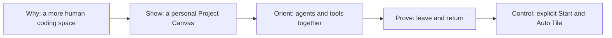

# Veluma — product vision and presentation direction

Recorded 5 September 2026 from the creator's explicit explanation and request to remember it. This is the primary vision reference for Veluma's portfolio cover (2.3) and project details (3.4). It supplements the implementation evidence; it does not claim new shipped capabilities.

## Creator's intent

The creator feels that many development tools increasingly resemble a factory: efficiency, output, convenience and cleanliness dominate the experience. In the drive to extract more performance from AI, the developer's feelings, personality and sense of life can disappear from the workspace.

Veluma is intended to give coding a more human setting: a workspace with mood, feeling, life, color and personal character. This is a reason for making the product, not a decorative theme applied after solving terminal management. Functional clarity still matters; maximum visual neutrality is not the creative goal.

The practical problem remains concrete: command-line sessions are scattered, projects need their own structure/context, and different AI agents and supporting tools need to coexist. Veluma gathers them into a project-specific Canvas. The product's emotional purpose and functional solution belong in the same story.

## Decision confirmed by the creator

- **Selected cover: A — Saved Canvas.** B — Auto Tile remains an unselected alternative and a useful secondary feature illustration.
- For the final cover, use **recognizable agent/tool icons alongside short names**, rather than text-only labels. Examples in the current evidence are Codex and Claude Code; server/shell panes need appropriate recognizable role icons. Verify the actual identity of every depicted tool and use its genuine mark where available. Keep readable names for unfamiliar visitors and accessibility.
- The final artwork should have more mood and life. A is the selected composition direction, not approval to freeze its current typography, text-only pane map or subdued treatment unchanged.
- FreeFlow B / ModeNote B selections remain unchanged. Phase 0 and phase 1 selection are complete for the three-project scope. Final refinements belong to phase 2; the new project-detail narrative belongs to phase 3.4. Neither phase starts from this note alone.

## Design implications for the cover — planned

1. Keep the real Canvas as the emotional center of A: backdrop, material, light, spacing and pane arrangement should feel like a workspace someone chose to inhabit.
2. Treat the small pane map as an orientation aid. Agent/tool icons make it recognizable quickly; its geometry explains that the same collection of tools belongs to this project.
3. Preserve real product color and verified brand identity. Added editorial text and diagram annotations remain white/gray under the portfolio's existing agreement. Color can live in the scene, materials and relevant iconography without colored text highlights.
4. Choose mood deliberately from available, appropriate product evidence. Do not force every scene into one warm palette or replace the user's aesthetic with generic neon, factory imagery, excessive tidiness or desaturated terminal grids.
5. Preserve the distinction between a saved arrangement and process execution. Returning to a Canvas does not automatically launch tools; Start remains deliberate.

No music, sensory settings, generated emotional response, measured productivity benefit or stress-reduction claim is implied. These would require separate capability or outcome evidence.

## Design implications for project details — planned

The current ordering treats backdrop/material largely as a late customization feature. Move the creator's intent and personal scene into the opening so the reader understands why Veluma looks this way before studying its mechanics. Use short creator-attributed copy and visual proof rather than a long manifesto.

| Story beat | What the visitor should understand | Evidence to use |
|---|---|---|
| Intent + first scene | The creator wanted coding to have mood and personality | A real Canvas image and a short statement attributed to the creator |
| Make it yours | Backdrop, pane material and arrangement shape a project's atmosphere | Inspect `canvas-material.gif` and suitable project-return frames before selecting captures; show actual customization |
| Gather the tools | One project keeps agents, servers and shells together | Agent/tool icons with names and a meaningful project boundary |
| Return | The working arrangement belongs to this project | Source-backed project-return sequence; separate layout from running state |
| Stay in control | Deliberate Start and Auto Tile support using that space | Existing Start / Auto Tile demos, followed by a compact lifecycle explanation |

Auto Tile remains helpful evidence; it should not become the whole identity of the product or imply the creator's goal was the most efficient terminal grid. The page should leave visitors understanding both what Veluma does and why this creator made it feel this way.

## Review questions for implementation

- Does the cover feel like a personal coding space while remaining recognizable as a terminal/agent product?
- Do the icons identify the tools without requiring the viewer to read tiny terminal text?
- Are backdrop/material part of the explanation of the product's purpose?
- Is the story specific to this creator's vision, with source-backed behavior and no invented outcomes?
- Do mobile and thumbnail crops preserve a meaningful scene and an obvious subject?
